# Brian Goodell

## My Work
Over the last year and a half, I have been employed in the [Flavell Lab](https://flavell.mit.edu/), where I both collaborate on projects and lead my own research.

### [AutoCellLabel Live](https://live.briandalegoodell.com)

<table border="0" cellspacing="0" cellpadding="0" role="presentation">
  <tr>
    <td valign="top">
      

        <a href="https://doi.org/10.7554/eLife.108159.1">AutoCellLabeler</a> is a 3D convolutional network which achieves very high accuracy on neuron identification in multi-channel fluorescent volumes. I extend this work by creating a network which is able to achieve high performance on a single channel (upper image) instead of four at nearly 50 times the speed. This involved both straight optimization (memory efficiency and speed boosts doing the same computation), network improvement (loss-rewriting, clever training, and exploring inference-time gains), and problem reframing (achieving the same result in a novel manner). The result is real-time labeling of neurons (lower image), and through a previously infeasible method, online trace extraction. This work lays a foundation for new experiments using the real state of the entire animal's brain to extract the basis of biological computation and decision making.
      

    </td>
    <td valign="top" align="right" width="320">
      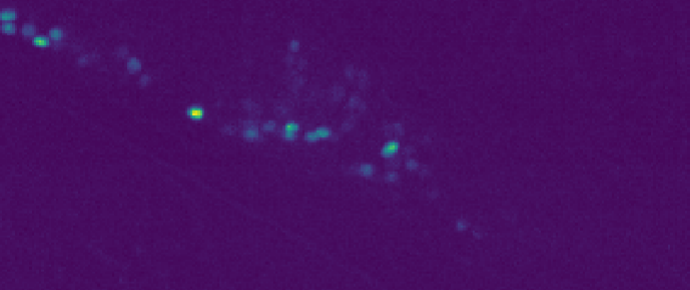
       
      <em>A raw fluorescent volume (single channel slice).</em>
       
       
       
      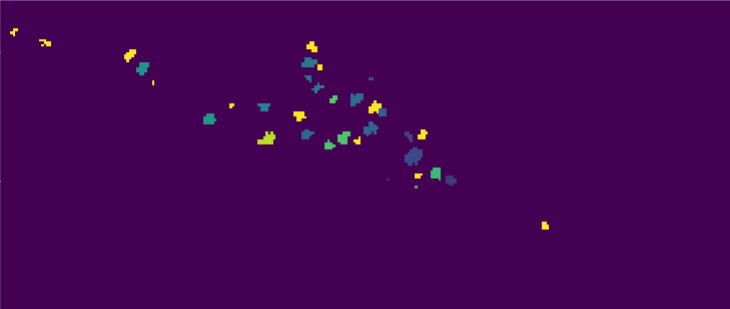
       
      <em>A labeled output volume (same slice).</em>
    </td>
  </tr>
</table>

[Learn more about ACL Live](https://live.briandalegoodell.com/)

### [The Laser Project](http://laser.briandalegoodell.com/)
C. elegans are very sensitive to temperature, being able to sense changes of ±0.01°C across a single sub-mm head swing. They also can robustly learn to navigate to a temperature at which they were previously exposed to food. This provides an opportunity to modify a salient input in order to view biological, goal-oriented decision making in great detail. So, to enable this experimentation, I developed a novel system which can provide a precise, but entirely manipulatable thermal environment to a nematode under our microscope: a worm's version of The Matrix (if Neo only cared about the thermostat).

<table border="0" cellspacing="0" cellpadding="0" role="presentation">
  <tr>
    <td valign="top" width="420">
      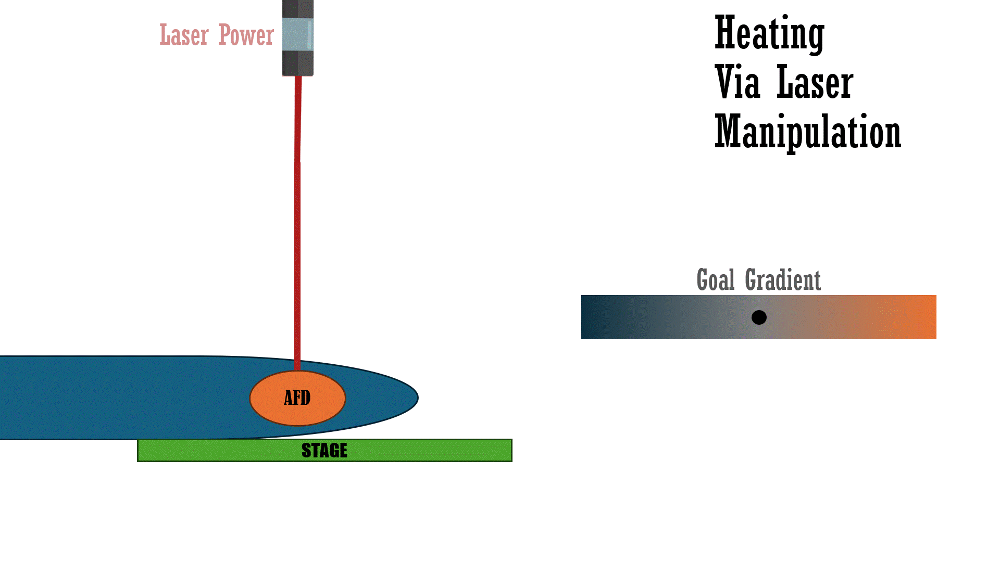
       
      <em>The laser power is modulated in response to the worm moving. The stage counteracts the movement to keep the worm centered.</em>
       
    </td>
    <td valign="top">
      

  We track the worm to keep it centered in the field of view, but also use that info to modulate the power of our NIR laser. We can specify an environment, say starting at 20°C and increasing 1° for every cm to the right, decreasing similarly to the left. As the worm moves around, the system calculates the required laser power for the worm to experience the proper temperature, even across a single several-second, sub-mm head swing. To achieve this fast control -- and temperatures lower than the ambient environment -- I developed a novel, but simple, cooling system which is able to provide controllable baseline environmental change without interfering with the microscope imaging wavelengths, laser heating wavelength, tracking camera, or worm.

    </td>
  </tr>
</table>

The vital difference between this system and any standard thermotaxis rig is not only that we can create any arbitrary environment, but that we can *change it instantly*. This enables unique experiments to isolate specific moments in its decision making process. We can determine how much it accumulates information vs making an in-the-moment decision. We can decouple head movement from body movement in calculating the experienced temperature to determine the nature of proprioception in their movement and environmental understanding. We can even provide physically impossible environments to test for internal rules which might allow for navigation.

[Learn more about the Laser Project](https://live.briandalegoodell.com/)

<table border="0" cellspacing="0" cellpadding="0" role="presentation">
  <tr>
    <td valign="top" width="350">
      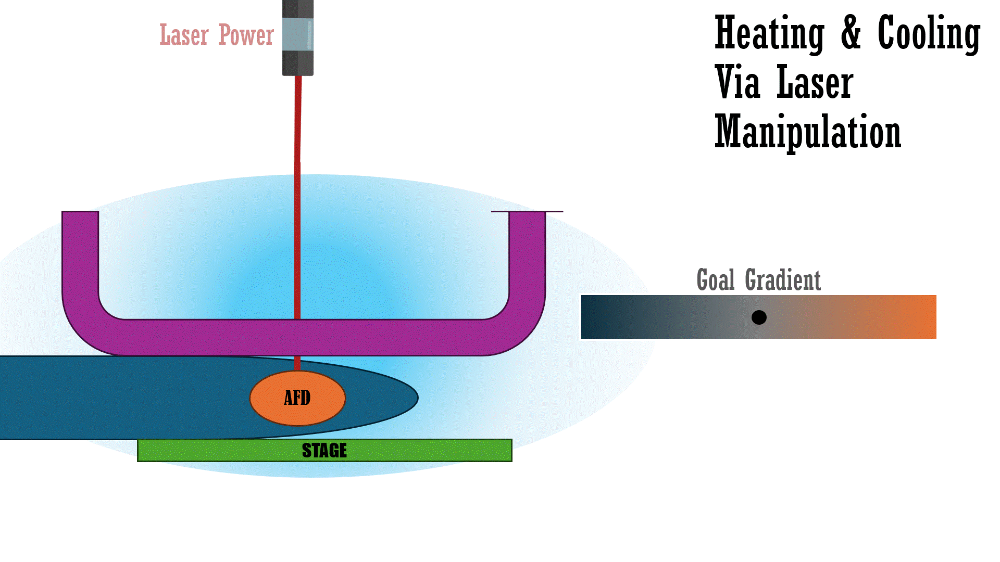
         
        <em>Cooling allows for simulated temperature decrease.</em>
         
    </td>
    <td valign="top">
      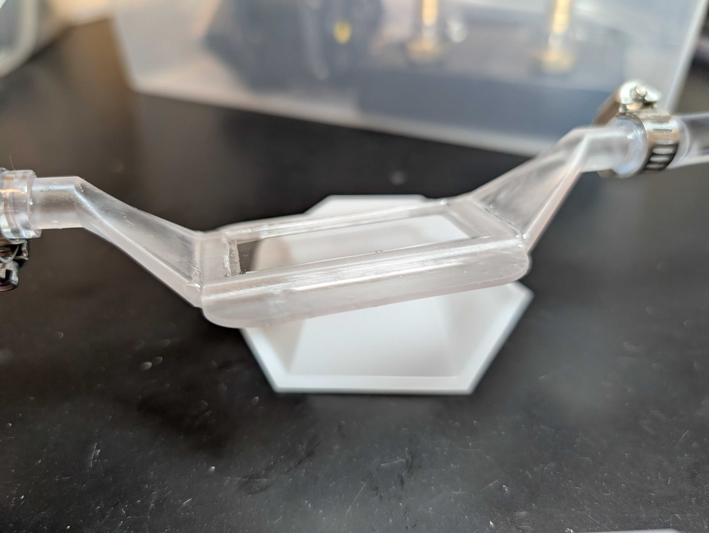
         
        <em>A custom partially 3D-printed component of the cooling system.</em>
         
    </td>
  </tr>
</table>

The real potential, however, comes from the combinations of my two projects, and their application when it comes to understanding internal computation. It's now simple to replay the exact same temperature profile (sensory input) to multiple worms to see how variations in neural activity are dependent (or not) on a given sensory input. Plus, we can intentionally and specifically manipulate that input based on how the brain responds. We can try to coach the worm to a chosen internal state via clever sensory cues. See how different inputs are processed depending on the current real state of the animal. Combined, we have immense control over the animal's sensation and the ability to make intelligent use of that power, rather than just analyzing our perturbations post hoc. This is truly exciting, and I can't wait to see what we discover!

### [BrainAlignNet](https://doi.org/10.7554/eLife.108159.1)
In contributing to the BrainAlignNet project, I was able to extend its application to another entire species. This was relatively straightforward, but still required careful consideration, implementation, and adjustment. Ultimately, it showed that our pipeline was robust and able to be extended to animals in entirely different branches of life (jellyfish) than what it was originally designed for (worms).

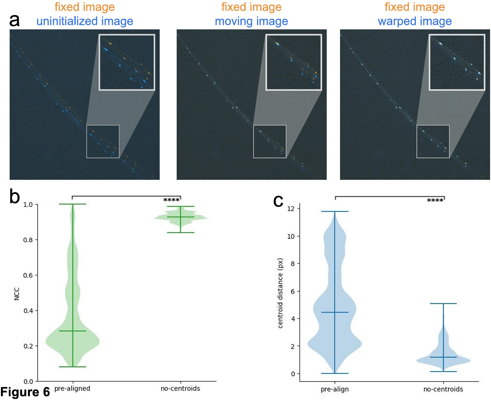

## Personal Projects
#### Software and Web Dev
Check out [RoosRun](https://roosrun.com), a website I made to help my Cross Country team stay connected! [Tank Game](https://github.com/bradleyramsey/TanksProject) and [GrinSync](https://github.com/GrinSync) are two school projects I'm proud of!

<!-- ### Life -->
#### The Van
Over COVID, I was lucky enough to be able to convert my family's minivan into a camper, with a custom futon, solar panels, and an antenna for robust cellular data. I did all of the futon woodworking, electronics wiring, and general conversion myself, and the trip was transformative. I was able to spend the half of my first year taking classes online in National Parks, reinforcing my love of nature, having independent responsibility, solving problems with limited resources, and learning to ask others for help (and directions).

    <a href="images/RandomProjects/BuffaloClass.jpg">
    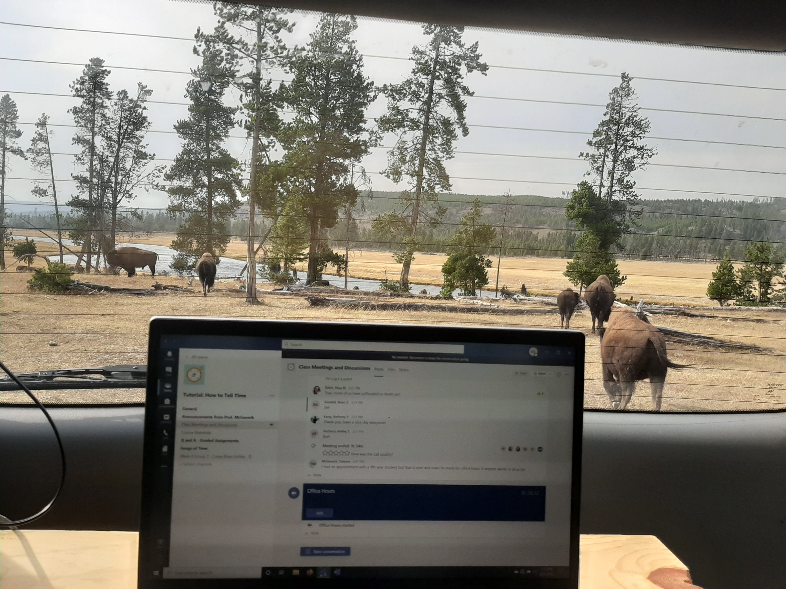
    </a>
     <em>I don't normally get this distracted during class</em>

### Wookworking
I'm an enthusiastic woodworker, reinforced by my 3 and a half years working in a makerspace. I've made furniture, art, and practical components for other projects. I love working with my hands, but also have come to appreciate the precision of CNC and other fabrication technologies.

<table border="0" cellspacing="0" cellpadding="0" role="presentation">
  <tr>
    <td align="center" valign="top">
      <a href="images/RandomProjects/LovelandGuy.jpg">
        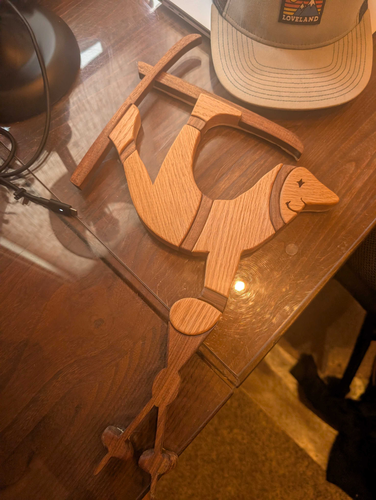
      </a>
       <em>The mascot of my uncle's work, made as a gift</em>
    </td>
    <td align="center" valign="top">
      <a href="images/RandomProjects/TrainDominosCenter.jpg">
        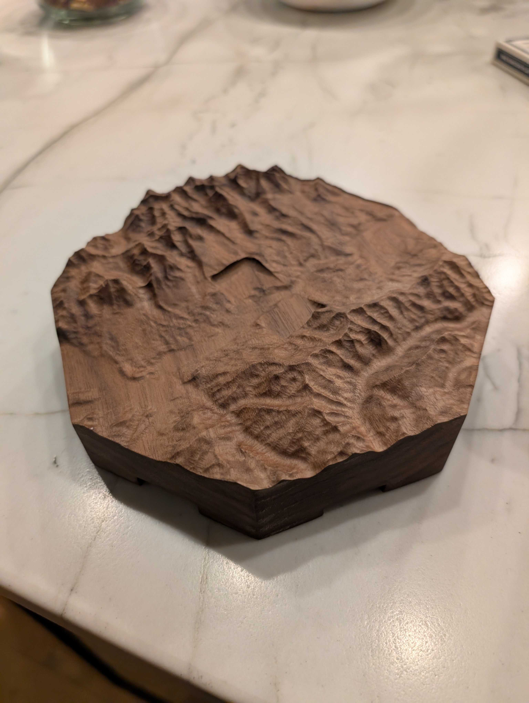
      </a>
       <em>The land around the same uncle's house, make to be the centerpiece of a train dominos set</em>
    </td>
    <td align="center" valign="top">
      <a href="images/RandomProjects/TableOil.jpg">
        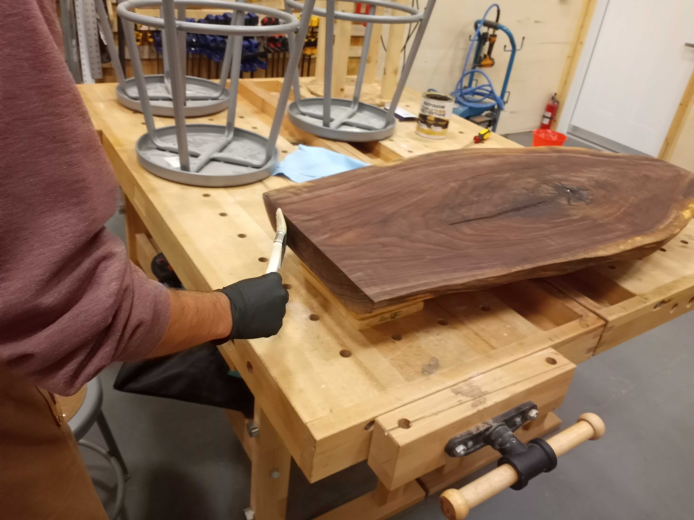
      </a>
       <em>My friend oils a beautiful walnut table as I advise him in the makerspace</em>
    </td>
  </tr>
</table>

<!-- ### Electronics -->
<!-- skip for now -->

### Cooking
I like to experiment in the kitchen, and have been recently focused on Tofu-manipulation. This exciting field has lots of potential to bring in cross-disciplinary work in high-dimensional sauce theory and even advanced breading techniques. My previous work has unfortunately been consumed before publication, but includes collecting wild raspberries and canning my own raspberry jam, making fresh, spiced, warm applesauce (divine!), and annual holiday fudge (which I share with my coworkers... (hire me) :wink:)

    <a href="images/RandomProjects/PreJelly.jpg">
    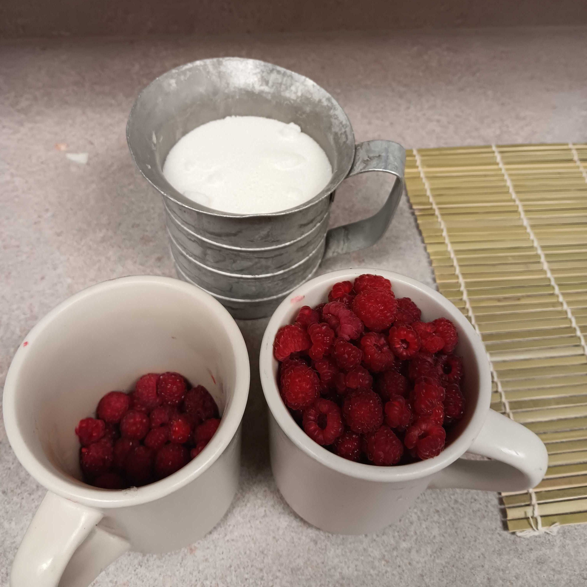
    </a>
     <em>Pre-Jam (the trial batch)</em>

### Miscellaneous Crafting
I've helped a friend create a hollow pool ball in order to propose to his girlfriend (back in high school, she used to always hide the 6 ball at his house), engraved the mountains around my uncle's house into wine glasses (another gift), [helped myself wake up in the morning](https://www.tiktok.com/@grinnellcollege/video/7327729021465251114?is_from_webapp=1&web_id=7318489099631281707), sewed, embroidered, and generally just had fun!

  <table border="0" cellspacing="0" cellpadding="0" role="presentation">
    <tr>
      <td align="center" valign="top">
        <a href="images/RandomProjects/MountainGlass.jpg">
          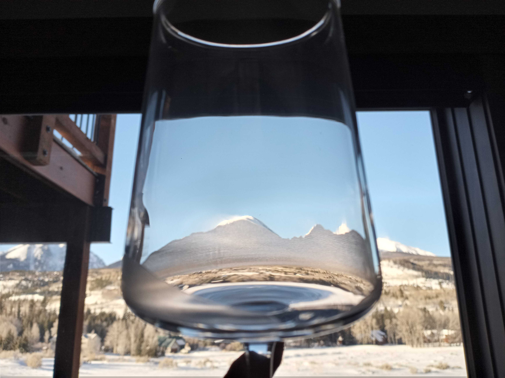
        </a>
         <em>Mountains in Miniature</em>
      </td>
      <td align="center" valign="top">
        <a href="images/RandomProjects/ScaryChocolate.jpg">
          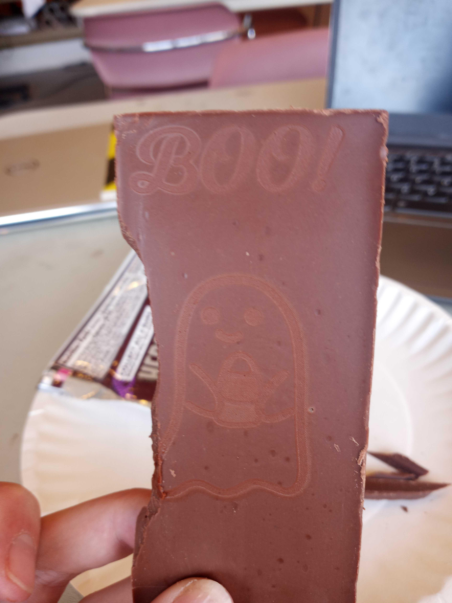
        </a>
         <em>Ahh!</em>
      </td>
    </tr>
  </table>

## Other Hobbies
In addition to making things, I love dancing, reading, and being outdoors. I'm a former Midwest Conference champion runner, Grinnell school record holder, and 4-time marathoner. In the winters, I keep running, but also love to ski! I've been attempting to get into triathlons, but while I'm able to swim and bike, I'm not very good at either, so that's a bit tough. I love to dance, having co-led both Grinnell Swing Society and Contra Dance Club, participating on MIT's ballroom dance team, and line dancing 2-3 nights a week here in Boston. Generally, I just love being active, having fun, and learning from people who are excited about a topic!

<!-- 

    
     <em>I recently started training my first bonsai, using a Blue Star Juniper sapling. A friendly neighborhood cat came to give its approval!</em>

 -->
